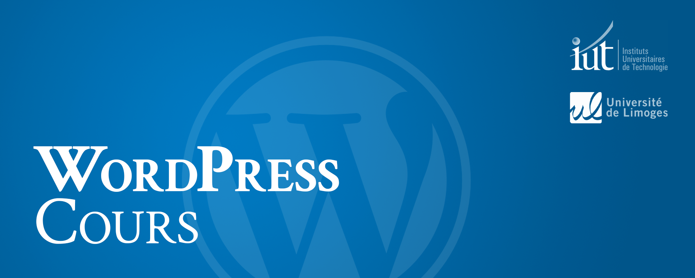
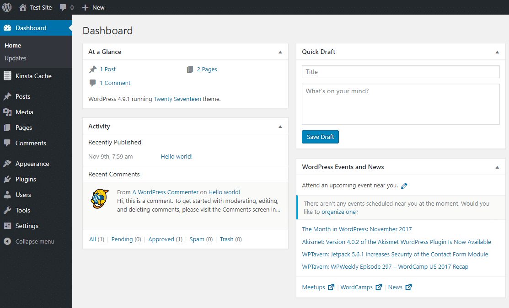
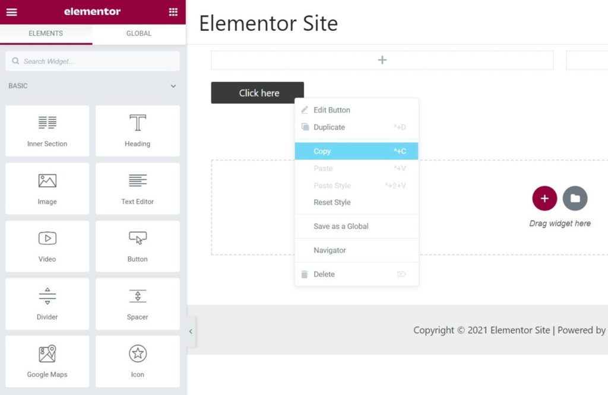
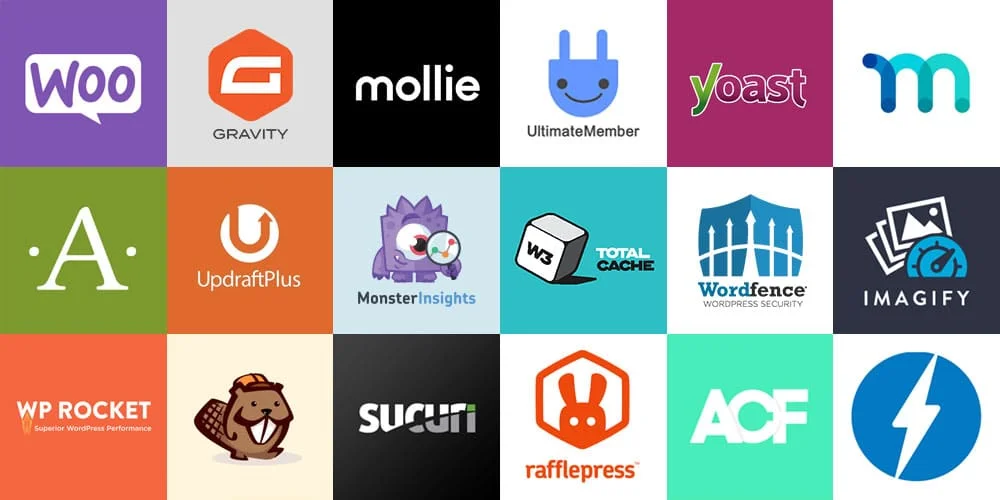

## 

**Date** : Mai 2025  
**Session** : MMI 1  
**Intervenant** : Florian Jourde  
**Contact** : [jourdeflorian@gmail.com](www.jourdeflorian@gmail.com)  

---

## 
<ol>
  <li><a href="#1-introduction">Introduction</a>
    <ol>
      <li>Qu'est-ce que WordPress ?</li>
      <li>Avantages et utilisations</li>
    </ol>
  </li>
  <li><a href="#2-installation">Installation et configuration</a>
    <ol>
      <li>Hébergement et installation</li>
      <li>Configuration de base</li>
    </ol>
  </li>
  <li><a href="#3-interface">Interface et contenu</a>
    <ol>
      <li>Navigation dans l'interface</li>
      <li>Création de pages et d'articles</li>
      <li>Gestion des médias</li>
    </ol>
  </li>
  <li><a href="#4-customization">Personnalisation</a>
      <ol>
        <li>Choix et modification des thèmes</li>
        <li>Utilisation des plugins</li>
    </ol>
  </li>
  <li><a href="#5-optimization">Optimisation et sécurité</a>
      <ol>
        <li>Optimisation pour les moteurs de recherche</li>
        <li>Bonnes pratiques de sécurité</li>
    </ol>
  </li>
  <li><a href="#6-maintenance">Maintenance et mises à jour</a>
      <ol>
        <li>Gestion des mises à jour</li>
        <li>Sauvegardes régulières</li>
    </ol>
  </li>
  <li><a href="#7-deploy">Déploiement du site</a>
      <ol>
        <li>Transfert en ligne</li>
        <li>Configuration finale</li>
    </ol>
  </li>
</ol>

---

<h2 id="1-introduction"> 


</h2>

### 

WordPress est un système de gestion de contenu (CMS) open-source qui permet de créer et de gérer des sites web de manière intuitive et efficace. Il a été initialement conçu comme une plateforme de blogging, mais au fil du temps, il est devenu un outil polyvalent utilisé pour la création de sites web de toutes sortes, des blogs personnels aux sites d'entreprise complexes.

WordPress offre une interface conviviale et une grande flexibilité grâce à son système de thèmes et de plugins. Les thèmes déterminent l'apparence visuelle du site, tandis que les plugins ajoutent des fonctionnalités supplémentaires, permettant ainsi aux utilisateurs de personnaliser leur site selon leurs besoins spécifiques.

### 

Les avantages de WordPress sont nombreux :

1. **Facilité d'utilisation** : WordPress est reconnu pour sa simplicité d'utilisation, même pour les débutants. Son interface intuitive permet de créer et de gérer du contenu sans nécessiter de connaissances techniques approfondies.

2. **Polyvalence** : WordPress peut être utilisé pour créer différents types de sites web, tels que des blogs, des sites vitrines, des boutiques en ligne, des portfolios, des forums, etc. Sa flexibilité en fait un outil adapté à divers besoins.

3. **Grande communauté et support** : WordPress bénéficie d'une vaste communauté d'utilisateurs et de développeurs qui fournissent un soutien technique, des tutoriels et des ressources en ligne. En cas de problème, il est facile de trouver de l'aide.

4. **Évolutif et extensible** : Avec des milliers de thèmes et de plugins disponibles, WordPress peut être étendu pour répondre à des besoins spécifiques. Que ce soit pour ajouter des fonctionnalités de commerce électronique, de référencement (SEO) ou de sécurité, il existe généralement un plugin adapté.

5. **Optimisation pour les moteurs de recherche (SEO)** : WordPress est conçu de manière à être convivial pour le référencement, ce qui facilite le classement dans les résultats des moteurs de recherche comme Google.

En résumé, WordPress est un outil puissant et polyvalent qui offre aux utilisateurs la possibilité de créer des sites web professionnels avec peu d'effort et de connaissances techniques. Que vous soyez un particulier, une entreprise ou une organisation, WordPress peut vous aider à concrétiser vos projets en ligne de manière efficace et élégante.

<h2 id="2-installation"> 


</h2>

### 

Pour utiliser WordPress, vous avez besoin d'un espace d'hébergement. Vous pouvez choisir entre des hébergements gratuits ou payants selon vos besoins. Une fois l'hébergement choisi, vous pouvez installer WordPress. Cela peut se faire via un installateur en un clic fourni par certains hébergeurs ou en installant manuellement les fichiers de WordPress sur votre serveur.

Une autre option populaire est d'utiliser un serveur local sur votre ordinateur, tel que Wamp, Xampp, ou Mamp. Ces outils vous permettent de créer un environnement de développement WordPress sur votre propre machine, idéal pour tester des thèmes, des plugins et des modifications sans affecter votre site en ligne.

### 

Une fois WordPress installé, vous accédez au tableau de bord administrateur. Configurez les paramètres de base comme le titre et la description de votre site, les permaliens, le format de date et d'heure. Vous pouvez également définir les réglages de lecture et de commentaires.



En bref, l'installation de WordPress nécessite un hébergement web ou un serveur local, suivi d'une configuration de base pour personnaliser votre site selon vos besoins.

<h2 id="3-interface"> 


</h2>

### 

Une fois connecté au tableau de bord de WordPress, vous serez accueilli par une interface ludique. Sur le côté gauche, vous trouverez le menu principal qui vous donne accès à toutes les fonctionnalités de WordPress. Vous pouvez naviguer entre les différentes sections telles que les Articles, les Pages, les Médias, les Commentaires, les Apparences, les Plugins, etc. En explorant ces sections, vous pouvez gérer et personnaliser votre site en toute simplicité.

### 

Pour créer du contenu sur votre site WordPress, vous avez le choix entre les pages et les articles. Les pages sont idéales pour le contenu statique tel que les pages d'accueil, À propos, Contact, etc. Les articles sont utilisés pour les publications régulières, telles que les actualités, les blogs, etc.

Traditionnellement, la création de pages et d'articles se fait via l'éditeur de texte WordPress. Cependant, il existe également des constructeurs de thèmes populaires comme **Elementor** ou **Divi** qui offrent une expérience de création de contenu plus visuelle et intuitive. Ces constructeurs permettent aux utilisateurs de créer des pages et des articles en utilisant un système de glisser-déposer, avec une multitude d'options de personnalisation disponibles. Ils offrent une approche plus flexible et dynamique pour la création de contenu, permettant aux utilisateurs de visualiser les modifications en temps réel et de créer des mises en page complexes sans nécessiter de compétences en codage.

### 

WordPress dispose d'une bibliothèque de médias où vous pouvez gérer tous les fichiers multimédias de votre site, tels que les images, les vidéos, les fichiers audio, etc. Pour ajouter un nouveau média, il vous suffit de cliquer sur "Ajouter un média" dans le menu Médias, puis de télécharger vos fichiers depuis votre ordinateur. Une fois téléchargés, vous pouvez les insérer dans vos pages ou articles en toute simplicité.

En résumé, la navigation dans l'interface WordPress est intuitive, vous permettant de créer et de gérer du contenu facilement. Que ce soit en ajoutant des pages, des articles ou des médias, WordPress offre une expérience utilisateur fluide et efficace.

<h2 id="4-customization"> 


</h2>

### 

Les thèmes définissent l'apparence visuelle de votre site WordPress. Vous pouvez choisir parmi une grande variété de thèmes disponibles, certains gratuits et d'autres payants. Pour sélectionner un thème, accédez à la section "Apparence" dans le tableau de bord de WordPress, puis cliquez sur "Thèmes". Parcourez les options disponibles, prévisualisez-les et choisissez celle qui correspond le mieux à vos besoins et à votre style. Une fois installé, vous pouvez personnaliser davantage votre thème en modifiant les couleurs, les polices, les mises en page, etc., selon vos préférences.

### 

Les plugins sont des extensions logicielles qui ajoutent des fonctionnalités supplémentaires à votre site WordPress. Que vous souhaitiez ajouter un formulaire de contact, un système de réservation, un système de paiement en ligne ou toute autre fonctionnalité, il y a probablement un plugin adapté à vos besoins.

Pour installer un plugin, accédez à la section "Extensions" dans le tableau de bord de WordPress, puis cliquez sur "Ajouter". Recherchez le plugin souhaité, installez-le et activez-le. Une fois activé, configurez les paramètres du plugin selon vos besoins. Veillez cependant à n'installer que des plugins fiables et mis à jour régulièrement pour garantir la sécurité et la performance de votre site.

Parmi les plugins les plus connus, on retrouve notamment :

1. **Classic Editor** : Avant la démocratisation de l'éditeur de thème via gestion de blocs Gutenberg, un éditeur de type WYSIWYG permettait de modifier le corps de la page. Cet éditeur correspondant à une ancienne version de Wordpress est désormais disponible en tant que plugin.

2. **Yoast SEO** : Ce plugin est un outil puissant pour l'optimisation des moteurs de recherche (SEO). Il vous aide à améliorer le référencement de votre site en vous fournissant des recommandations sur les mots-clés, les titres, les méta-descriptions, etc.

3. **Advanced Custom Fields** : Ce plugin permet d'ajouter facilement des champs personnalisés à vos articles, pages et types de publication personnalisés. Il offre une grande flexibilité pour structurer vos contenus et créer des sites web plus dynamiques et personnalisés.

4. **Elementor** : Il s'agit d'un constructeur de pages visuel qui vous permet de créer des mises en page complexes et esthétiques sans avoir besoin de connaissances en codage. Il offre une expérience de conception intuitive avec un système de glisser-déposer.  


5. **Akeeba Backup** : Ce plugin vous permet de sauvegarder facilement votre site WordPress et de le restaurer en cas de besoin. Il offre des options de sauvegarde complètes et flexibles, y compris le stockage sur cloud.

6. **Contact Form 7** : Il s'agit d'un plugin de formulaire de contact très populaire et facile à utiliser. Il vous permet de créer rapidement des formulaires de contact personnalisés et de les intégrer à votre site.

7. **WooCommerce** : Il s'agit du plugin e-commerce le plus populaire pour WordPress. Il vous permet de créer facilement une boutique en ligne, de gérer vos produits, les paiements, les livraisons, etc.

8. **WP Super Cache** : Ce plugin vous aide à optimiser les performances de votre site en générant des fichiers HTML statiques à partir de vos pages WordPress dynamiques. Cela permet de réduire le temps de chargement des pages et d'améliorer l'expérience utilisateur.

En utilisant judicieusement ces plugins, vous pouvez étendre les fonctionnalités de votre site WordPress et améliorer son efficacité, sa sécurité et sa convivialité pour vos utilisateurs.



<h2 id="5-optimization"> 


</h2>

### 

L'optimisation pour les moteurs de recherche (SEO) est essentielle pour améliorer la visibilité de votre site WordPress dans les résultats des moteurs de recherche tels que Google. Pour optimiser votre site, commencez par choisir des mots-clés pertinents pour votre contenu et assurez-vous de les intégrer de manière naturelle dans vos titres, descriptions et contenus. Utilisez des permaliens conviviaux qui contiennent des mots-clés, et organisez votre contenu avec des titres et sous-titres appropriés pour une meilleure lisibilité. En outre, assurez-vous que votre site se charge rapidement, car la vitesse de chargement est un facteur important pour le référencement. Utilisez des images optimisées, réduisez le nombre de plugins inutiles et utilisez des outils de mise en cache pour améliorer les performances de votre site.

### 

La sécurité est un aspect crucial de la gestion d'un site WordPress. Pour protéger votre site contre les cyberattaques et les violations de sécurité, il est important de suivre quelques bonnes pratiques de sécurité. Tout d'abord, assurez-vous de maintenir votre installation WordPress, ainsi que vos thèmes et plugins, à jour en installant les dernières mises à jour de sécurité. Utilisez des mots de passe forts pour vos comptes administrateurs et évitez d'utiliser le nom d'utilisateur "admin". Limitez les tentatives de connexion en utilisant des plugins de sécurité comme Wordfence ou Sucuri, et configurez des sauvegardes régulières de votre site pour pouvoir restaurer votre site en cas d'urgence. Enfin, utilisez des certificats SSL pour sécuriser les communications entre votre site et vos visiteurs, en garantissant que les données sont cryptées lors de leur transmission.

En mettant en œuvre ces bonnes pratiques d'optimisation et de sécurité, vous pouvez améliorer la visibilité de votre site dans les résultats de recherche tout en assurant sa protection contre les menaces en ligne.

<h2 id="6-maintenance"> 


</h2>

### 

La gestion des mises à jour est essentielle pour maintenir la sécurité, la performance et la compatibilité de votre site WordPress. Assurez-vous de garder votre installation WordPress, ainsi que vos thèmes et plugins, à jour en installant les dernières mises à jour dès qu'elles sont disponibles. Les mises à jour incluent souvent des correctifs de sécurité, des améliorations de performances et des fonctionnalités nouvelles ou améliorées. Vous pouvez vérifier et installer les mises à jour depuis le tableau de bord de WordPress, dans les sections "Mises à jour" pour WordPress lui-même, et "Extensions" pour les thèmes et les plugins. Il est recommandé de sauvegarder votre site avant d'effectuer des mises à jour importantes pour éviter toute perte de données en cas de problème.

### 

Les sauvegardes régulières sont essentielles pour protéger vos données et votre site contre toute perte éventuelle. Planifiez des sauvegardes régulières de votre site WordPress, y compris la base de données et les fichiers, en utilisant des plugins de sauvegarde fiables. Vous pouvez configurer des sauvegardes automatiques quotidiennes, hebdomadaires ou mensuelles, selon la fréquence de mise à jour de votre contenu. Stockez vos sauvegardes dans un endroit sécurisé en dehors de votre serveur, comme un service de stockage cloud ou un emplacement hors site, pour éviter toute perte en cas de catastrophe. En cas de problème sur votre site, vous pourrez ainsi restaurer facilement une version précédente à partir de vos sauvegardes.

<h2 id="7-deploy"> 


</h2>

### 

Une fois que votre site WordPress est prêt à être publié sur Internet, vous devez le transférer depuis votre serveur local ou de développement vers un serveur en ligne. Pour cela, vous devez choisir un fournisseur d'hébergement web et souscrire à un plan d'hébergement adapté à vos besoins. Ensuite, vous pouvez transférer les fichiers de votre site WordPress sur le serveur en ligne à l'aide d'un client FTP ou en utilisant les outils de migration fournis par votre hébergeur. Assurez-vous également de transférer votre base de données et de configurer correctement les paramètres de connexion à la base de données sur le serveur en ligne.

### 

Une fois votre site WordPress transféré en ligne, effectuez une dernière vérification pour vous assurer que tout fonctionne correctement. Testez la navigation sur votre site, assurez-vous que tous les liens sont fonctionnels et que le contenu s'affiche correctement. Vérifiez également que les fonctionnalités telles que les formulaires de contact, les boutons de partage social, les paiements en ligne, etc., fonctionnent comme prévu. Enfin, configurez les paramètres de domaine pour que votre site soit accessible via votre nom de domaine personnalisé, si vous en avez un. Une fois cette configuration finale terminée, votre site WordPress est prêt à être visité par vos utilisateurs en ligne.

---

## 

### 

https://chromewebstore.google.com/detail/wappalyzer-technology-pro/gppongmhjkpfnbhagpmjfkannfbllamg?hl=fr&utm_source=ext_sidebar

Installation Wordpress : sauvegardez bien votre base de données !

Ctrl + Maj + v : Coller sans mise en forme
CMS: Content Managmenet System
Principaux frameworks : React (Facebook), Angular (Google), Vue.js (ancien de Google) : dynamisme, simplicité d'utilisation
Frameworks backend : Symfony, Laravel, Django, Ruby on Rails...
AJAX : Rechargement asynchrone
Pipeline CI/CD : déploiement continu integration continu - Continious Integration / Continuons Development
Photopea : Editeur d'image type "Photoshop" gratuit
Décompression partielle d'une archive
Windows + Maj + S

FileZilla / WinSCP : Afficher / Editer
  - FileZilla > Paramètres > Edition des fichiers > Association par type de fichiers
```
css "C:\Program Files\Microsoft VS Code\Code.exe" %f
php "C:\Program Files\Microsoft VS Code\Code.exe" %f
html "C:\Program Files\Microsoft VS Code\Code.exe" %f
javascript "C:\Program Files\Microsoft VS Code\Code.exe" %f
``` 

## 

- https://wordpress.org/
- https://www.akeeba.com/
- https://capitainewp.io/